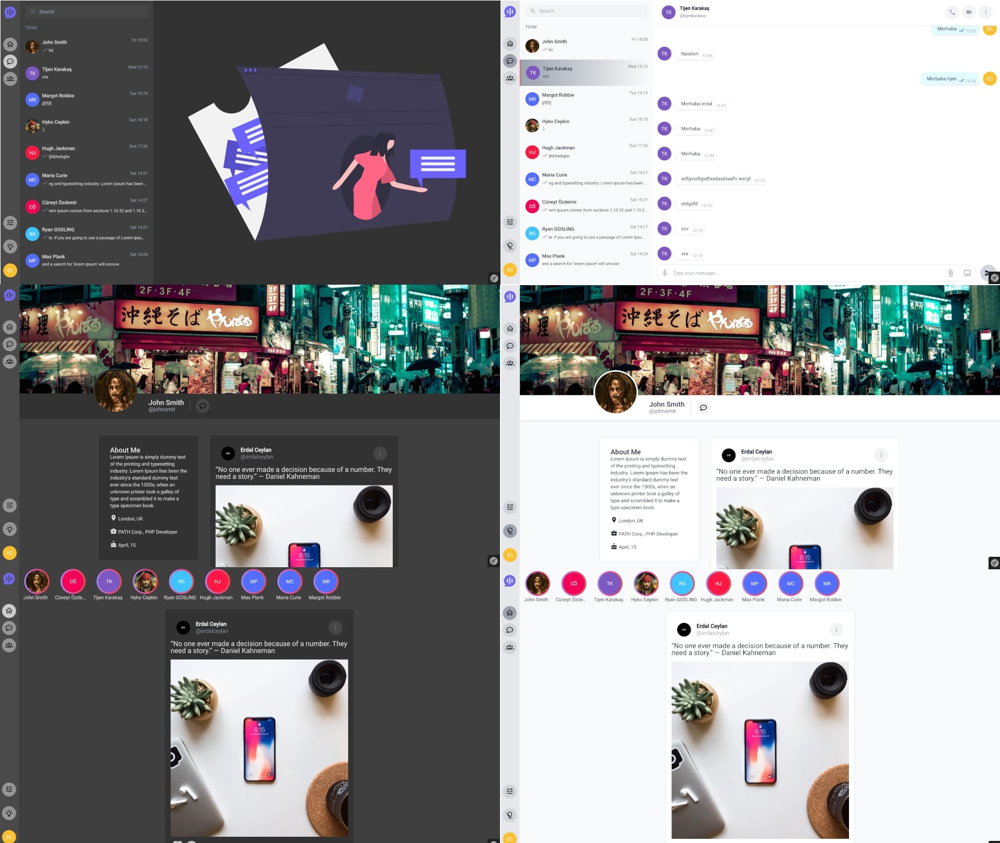

## JAVA Spring Boot - Social Media and Chat APP - endpoint

### JDK 17 is a prerequisite for this application.

### Run with Docker

create docker network 
```sh
docker network create --driver bridge blize-network
```

run for install dependencies
```sh
 ./gradlew dependencies
```

run for build project to *.jar file
```sh
 ./gradlew build
```

run for up project
```sh
docker-compose up -d
```

fill dummy data (Users, Messages, Stories)
```sh
java -jar build/libs/blize-java-SNAPSHOT.jar Fill-Dummy-Data
```


Blize Social Media  Websocket [https://github.com/erdalceylan/blize-socket](https://github.com/erdalceylan/blize-socket)

Blize Social Media Angular frontend [https://github.com/erdalceylan/blize-angular](https://github.com/erdalceylan/blize-angular)



